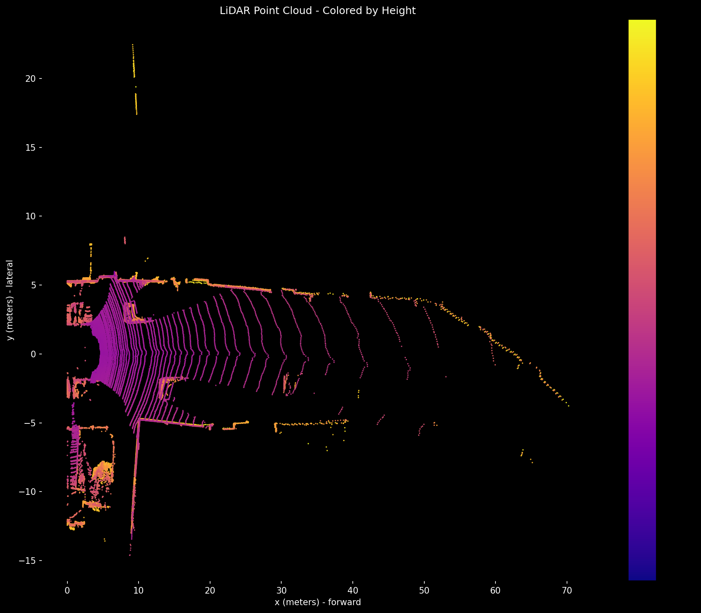
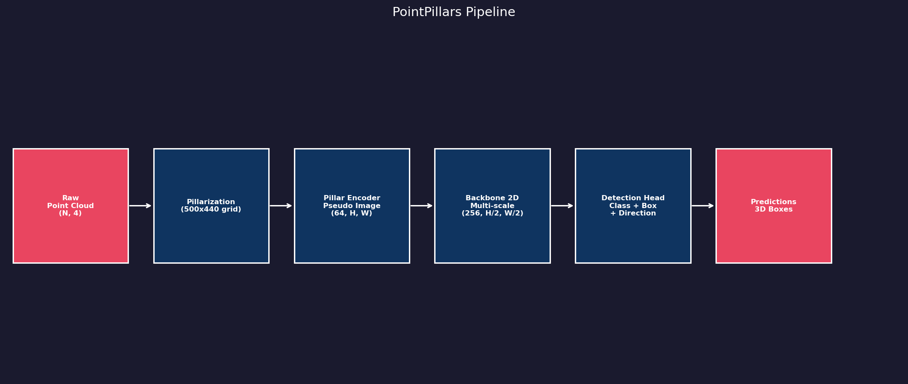
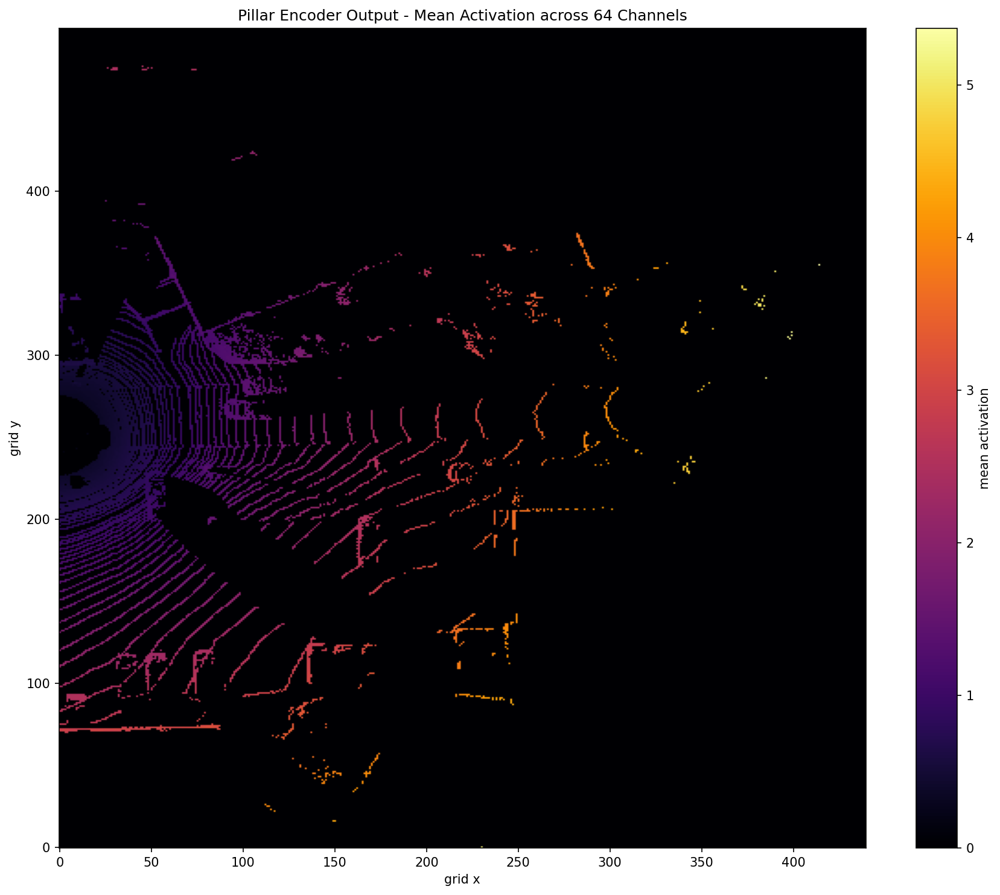
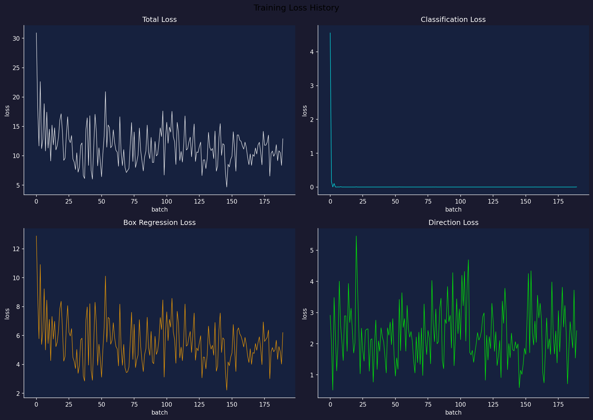
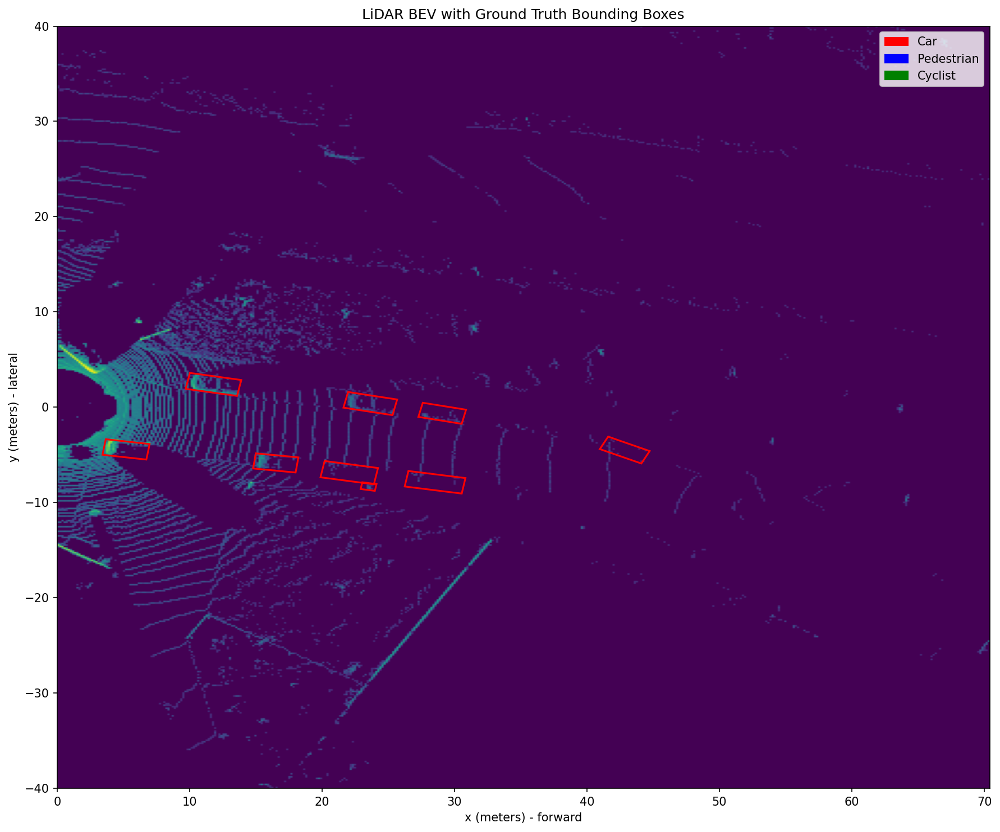

# PointPillars 3D Object Detection

A from-scratch implementation of the PointPillars architecture for 3D object detection on LiDAR point clouds, trained and evaluated on the KITTI dataset.


---

## Problem Definition

Autonomous vehicles need to detect and locate objects like cars, pedestrians and cyclists in 3D space. Cameras provide rich texture information but struggle with depth estimation. LiDAR sensors solve this by returning precise 3D point clouds of the surrounding environment.

The challenge is that point clouds are sparse, unordered and variable in size, which makes them incompatible with standard 2D convolutional networks. PointPillars solves this by converting the 3D point cloud into a 2D pseudo-image that a CNN can process efficiently, achieving real-time inference speeds without sacrificing accuracy.

---

## Dataset

This project uses the [KITTI 3D Object Detection Benchmark](http://www.cvlibs.net/datasets/kitti/eval_object.php?obj_benchmark=3d), one of the most widely used datasets in autonomous driving research.

Each sample consists of:
- A LiDAR point cloud stored as a `.bin` file with `(x, y, z, reflectance)` per point
- Ground truth bounding boxes in `label_2` files with class, dimensions, position and rotation
- Calibration files mapping between LiDAR and camera coordinate systems

The dataset contains annotations for three classes: **Car**, **Pedestrian** and **Cyclist**.

> Note: KITTI labels are defined in camera coordinates. This project applies a coordinate transform to convert them to LiDAR space before training and visualization.


*LiDAR point cloud colored by height. Purple points are near ground level, yellow points are elevated structures like buildings and poles.*

---

## Pipeline & Architecture

The full pipeline takes a raw point cloud and produces class predictions, 3D bounding boxes and orientation estimates.



```
Raw Point Cloud (N, 4)
        |
        v
  Pillarization          split space into a XY grid and group points into pillars
        |
        v
  Pillar Encoder         MLP per point + max pooling -> pseudo image (64, H, W)
        |
        v
  Backbone 2D            two conv blocks at different strides -> (256, H/2, W/2)
        |
        v
  Detection Head         three parallel conv heads -> class, box and direction preds
```

### Pillarization

The first step converts the unstructured point cloud into a structured representation. The sensing range is divided into a 2D grid of cells with a fixed size of `0.16m x 0.16m`, producing a grid of `500 x 440` cells covering a `70.4m x 80m` area.

Each point is assigned to the cell it falls into based on its `(x, y)` coordinates. These groups of points are called **pillars** because they extend vertically through the full z range of the cell. Pillars with more points than the configured maximum are randomly subsampled.

Each point is augmented from 4 raw features to 9:

| Feature | Description |
|---|---|
| x, y, z | absolute position |
| r | reflectance intensity |
| xc, yc, zc | distance to pillar centroid |
| xp, yp | distance to cell geometric center |

The centroid features capture the local shape of the point cluster. The cell center features tell the network where in the world this pillar sits, solving the positional ambiguity that would arise from using only relative coordinates.

### Pillar Encoder

The encoder converts each pillar into a single feature vector, which becomes one pixel of the pseudo image. It uses the same core idea as PointNet: apply a shared MLP to each point independently, then aggregate with max pooling.

```
pillar (num_points, 9)
    -> Linear + BatchNorm + ReLU  applied per point
    -> (num_points, 64)
    -> max pooling over points
    -> (64,)   <- one pixel
```

Max pooling is used because it is invariant to the order of points within a pillar and selects the most prominent feature across all points regardless of how many points the pillar contains. After processing all pillars, each feature vector is placed back at its `(i, j)` position in the grid via a scatter operation, producing the final pseudo image of shape `(64, 440, 500)`.


*Mean activation across the 64 channels of the pillar encoder output. Brighter areas correspond to pillars with stronger learned features, which tend to align with object boundaries and dense point clusters.*

### Backbone 2D

The backbone is a standard 2D CNN that extracts multi-scale features from the pseudo image. It uses two convolutional blocks at different spatial resolutions and concatenates their outputs.

```
pseudo image (64, H, W)
    -> block_one: stride 2  -> (64, H/2, W/2)    fine spatial detail
    -> block_two: stride 2  -> (128, H/4, W/4)   broader context
    -> stretch block_one    -> (128, H/2, W/2)
    -> stretch block_two    -> (128, H/2, W/2)
    -> concatenate          -> (256, H/2, W/2)
```

Concatenating both scales gives the detection head both precise localization information from the shallower features and richer semantic context from the deeper features.

### Detection Head

The detection head applies three parallel `1x1` convolutions over the `(256, H/2, W/2)` feature map. Each spatial position corresponds to two anchors, one at 0 degrees and one at 90 degrees.

| Head | Output channels | Loss |
|---|---|---|
| class_head | `num_anchors * num_classes` = 6 | CrossEntropyLoss |
| box_head | `num_anchors * 7` = 14 | SmoothL1Loss |
| dir_head | `num_anchors * 2` = 4 | CrossEntropyLoss |

The 7 box regression values are `(x, y, z, length, width, height, rotation)`. Rather than predicting absolute coordinates, the model predicts **deltas** relative to the anchor, normalized by anchor dimensions. Dimension deltas use a log encoding to ensure predicted sizes are always positive.

### Loss & Anchor Matching

Each cell in the output grid has 2 anchors, producing `220 x 250 x 2 = 110,000` anchors per sample. The loss requires matching these anchors against the ground truth boxes using Intersection over Union (IoU) computed in Bird Eye View.

```
IoU >= 0.5   ->  positive anchor, trains class + box + direction loss
IoU <= 0.35  ->  negative anchor, trains class loss only
in between   ->  ignored anchor, does not contribute to loss
```

To address the extreme imbalance between positive and negative anchors, **hard negative mining** keeps at most 3 negative anchors per positive anchor, selecting the ones with the highest classification loss.

The total loss is a weighted sum of the three individual losses:

```
total_loss = 1.0 * cls_loss + 2.0 * box_loss + 0.2 * dir_loss
```

---

## Results

Training was run for 10 epochs on 750 samples from the KITTI training set on CPU.



| Epoch | Avg Loss | Notes |
|---|---|---|
| 1 | 17.25 | random initialization |
| 3 | 12.90 | cls loss already near zero |
| 7 | 11.45 | box loss still converging |
| 10 | 11.80 | stable, no divergence |

The classification loss converges quickly while the box regression loss decreases more slowly, which is expected since coordinate regression is a harder task than binary classification. The direction loss shows high variance throughout training, which is consistent with limited training data.


*Ground truth bounding boxes overlaid on the BEV density map. Red boxes indicate cars annotated in the KITTI label files, correctly aligned with dense point clusters.*

### Current Limitations

The model has not fully converged due to hardware and data constraints. Inference currently produces a high false positive rate because the classification head learned to predict high confidence scores across most anchors rather than discriminating between background and objects.

Root causes:
- Trained on 750 out of 7481 available samples
- No GPU available, CPU training limits practical dataset size
- No learning rate scheduler, which would help fine-grained convergence
- No Non-Maximum Suppression (NMS) to filter overlapping predictions

Future work:
- Train on the full dataset with GPU compute
- Add NMS post-processing to suppress redundant detections
- Add a learning rate scheduler
- Evaluate using the official KITTI mAP metric at IoU thresholds of 0.5 and 0.7

---

## Installation & Usage

```bash
git clone https://github.com/your-username/PointPillars-3D-Detection
cd PointPillars-3D-Detection
pip install -r requirements.txt
```

Place the KITTI data under `data/kitti/` with the following structure:

```
data/kitti/
└── train/
    ├── velodyne/    # .bin files
    └── label_2/    # .txt annotation files
```

Run the forward pass test to verify everything is wired correctly:

```bash
python test_forward.py
```

Generate BEV visualizations for a sample:

```bash
python visualize.py
```

Start training:

```bash
python train.py
```

Run inference on a sample:

```bash
python inference.py
```

---

## Technologies

| Tool | Role |
|---|---|
| Python 3.10 | primary language |
| PyTorch | model definition, training loop and loss computation |
| NumPy | point cloud processing and anchor generation |
| Matplotlib | BEV visualization and bounding box rendering |
| KITTI Benchmark | dataset with LiDAR scans and 3D annotations |

---

## Conclusions

This project implements PointPillars from scratch with a focus on understanding every design decision rather than relying on existing libraries. The key insights from building this pipeline are:

The pillarization step is what makes the whole approach viable. Converting an unordered 3D point cloud into a regular 2D grid unlocks the use of standard CNN building blocks without any modification.

Max pooling over pillar points is a principled solution to the orderless nature of point clouds. The result is invariant to how points are ordered within a pillar.

Multi-scale feature concatenation in the backbone is essential for detecting objects at different distances. Shallow features preserve spatial precision while deep features capture broader context.

Anchor matching with IoU thresholds and hard negative mining is what makes the loss signal meaningful despite the massive imbalance between empty and occupied grid cells.

Delta encoding for box regression, combined with log encoding for dimensions, makes the learning problem significantly easier by normalizing the target distribution and ensuring predicted sizes are always positive.